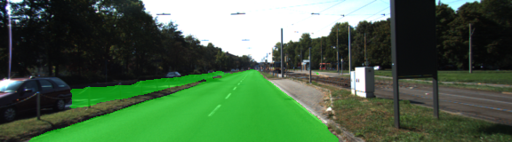
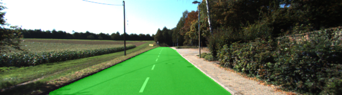

# Semantic Segmentation
### Introduction
In this project, the pixels of a road are labeled in images using a Fully Convolutional Network (FCN).

### Setup
##### GPU
`main.py` will check to make sure you are using GPU - if you don't have a GPU on your system, you can use AWS or another cloud computing platform.
##### Frameworks and Packages
Make sure you have the following is installed:
 - [Python 3](https://www.python.org/)
 - [TensorFlow](https://www.tensorflow.org/)
 - [NumPy](http://www.numpy.org/)
 - [SciPy](https://www.scipy.org/)

You may also need [Python Image Library (PIL)](https://pillow.readthedocs.io/) for SciPy's `imresize` function.

##### Dataset
Download the [Kitti Road dataset](http://www.cvlibs.net/datasets/kitti/eval_road.php) from [here](http://www.cvlibs.net/download.php?file=data_road.zip).  Extract the dataset in the `data` folder.  This will create the folder `data_road` with all the training a test images.

### Start
##### Implement
Implement the code in the `main.py` module indicated by the "TODO" comments.
The comments indicated with "OPTIONAL" tag are not required to complete.
##### Run
Run the following command to run the project:
```
python main.py
```
The following parameters where used for the training: **Note:** 

#### Example Outputs

### Submission
1. Ensure you've passed all the unit tests. **Note:**
2. Ensure you pass all points on [the rubric](https://review.udacity.com/#!/rubrics/989/view). **Note:**
3. Submit the following in a zip file. 
 - `helper.py`
 - `main.py`
 - `project_tests.py`
 - Newest inference images from `runs` folder  (**all images from the most recent run**)
 
### Tips
- The link for the frozen `VGG16` model is hardcoded into `helper.py`.  The model can be found [here](https://s3-us-west-1.amazonaws.com/udacity-selfdrivingcar/vgg.zip).

- The model is not vanilla `VGG16`, but a fully convolutional version, which already contains the 1x1 convolutions to replace the fully connected layers. Please see this [post](https://s3-us-west-1.amazonaws.com/udacity-selfdrivingcar/forum_archive/Semantic_Segmentation_advice.pdf) for more information.  A summary of additional points, follow. 

- The original FCN-8s was trained in stages. The authors later uploaded a version that was trained all at once to their GitHub repo.  The version in the GitHub repo has one important difference: The outputs of pooling layers 3 and 4 are scaled before they are fed into the 1x1 convolutions.  As a result, some students have found that the model learns much better with the scaling layers included. The model may not converge substantially faster, but may reach a higher IoU and accuracy.

- When adding l2-regularization, setting a regularizer in the arguments of the `tf.layers` is not enough. Regularization loss terms must be manually added to your loss function. otherwise regularization is not implemented.

### Why Layer 3, 4 and 7?
In `main.py`, you'll notice that layers 3, 4 and 7 of VGG16 are utilized in creating skip layers for a fully convolutional network. The reasons for this are contained in the paper [Fully Convolutional Networks for Semantic Segmentation](https://arxiv.org/pdf/1605.06211.pdf).

In section 4.3, and further under header "Skip Architectures for Segmentation" and Figure 3, they note these provided for 8x, 16x and 32x upsampling, respectively. Using each of these in their FCN-8s was the most effective architecture they found. 


### Rubric
Does the project load the pretrained vgg model? *** Done ***
	
The function load_vgg is implemented correctly. *** Done ***

Does the project learn the correct features from the images? *** Done ***
	
The function layers is implemented correctly. *** Done ***

Does the project optimize the neural network? *** Done ***
	
The function optimize is implemented correctly. *** Done ***

Does the project train the neural network? *** Done ***
	
The function train_nn is implemented correctly. The loss of the network should be printed while the network is training. *** Done ***

Does the project train the model correctly? *** Done ***
	
On average, the model decreases loss over time. *** Done ***

Does the project use reasonable hyperparameters? *** Done ***	

The number of epoch and batch size are set to a reasonable number. *** Done ***
Number of epochs: 48
Batch size:  5

Does the project correctly label the road? *** Done ***
	
The project labels most pixels of roads close to the best solution. The model doesn't have to predict correctly all the images, just most of them. *** Done ***

A solution that is close to best would label at least 80% of the road and label no more than 20% of non-road pixels as road. *** Done ***






